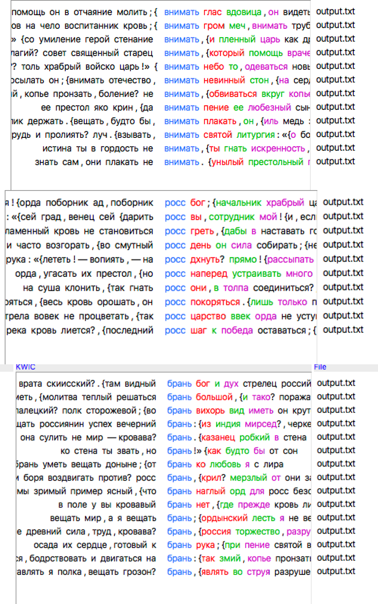
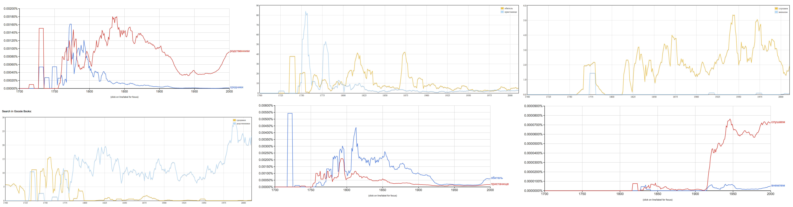
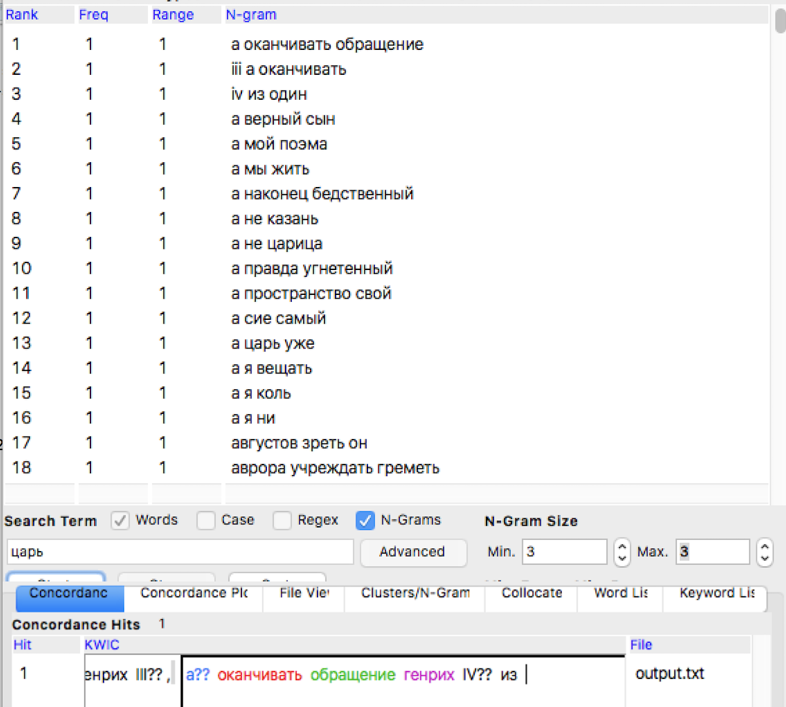
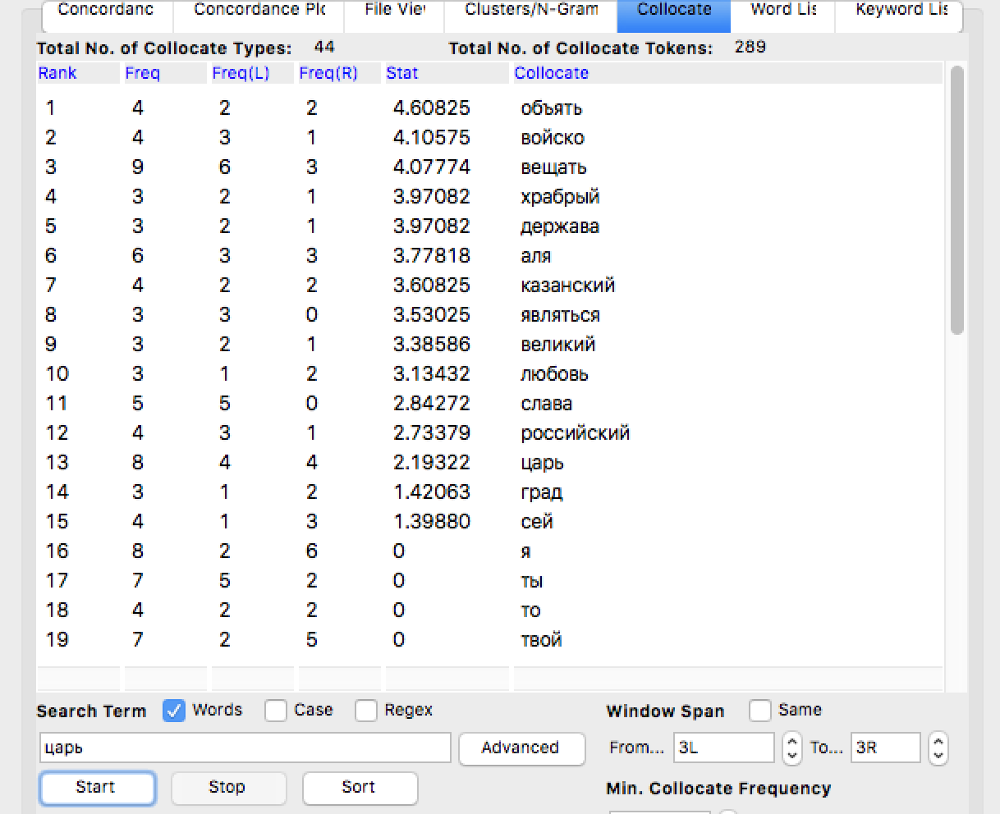
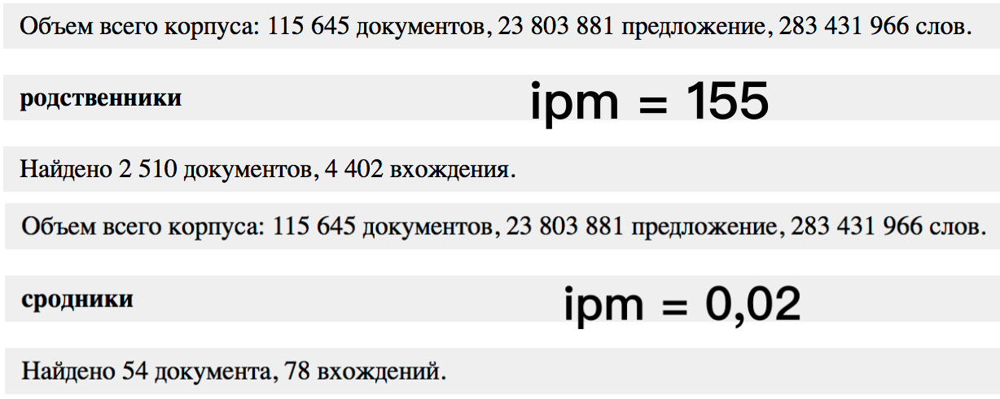

# HW3
## корпус и антконт

*Исследование корпуса - очень важный и полезный инструмент*
иногда в диахронической перцепции текста статистические и корпусные инструменты позволяют узнать новое
и незаметное при первичном прочтении как с лингвистической так и с семантической точки зрения.
